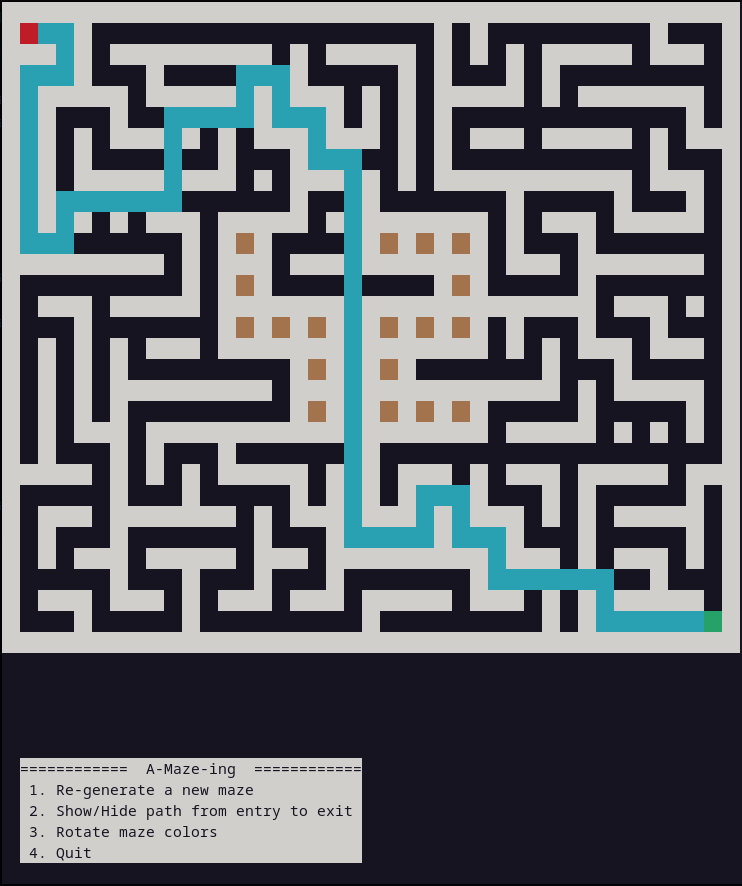
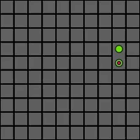
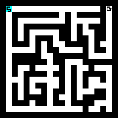

*This project has been created as part of the 42 curriculum by marberge, stmaire.*

<div align="center">
<br>
  

  <br>
</div>

# A-Maze-ing


## I. Description

**A-Maze-ing** is a comprehensive Python package dedicated to the generation and resolution of two-dimensional mazes. Developed as part of the 42 curriculum, this project implements fundamental graph theory algorithms to transform a blank grid into a complex, structured puzzle.

<div align="center">
<br>
  

  <br>
</div>

### Project Goals

The primary objective is to provide a robust library capable of:

* **Generating** mazes of variable dimensions ($N \times M$), ensuring either a **perfect maze** (a unique path with no loops) or an **imperfect maze** (multiple possible paths via an adjustable imperfection rate).
* **Solving** for the shortest path between two given coordinates efficiently using a graph traversal algorithm.
* **Exporting** data in a standardized format, including a hexadecimal representation of the grid (wall encoding) and the sequence of cardinal directions (N, S, E, W) constituting the solution.

### Technical Overview

The project is built on an object-oriented architecture where each **Cell** manages its own wall states. The core engine, the `MazeGenerator`, orchestrates the various stages: from grid initialization to the production of an output file compliant with the subject's specifications. 

## II. Instructions

This project includes a Makefile to automate setup, execution, and code quality control. Python 3.10+ is required.

### 1. Installation

The installation process sets up a virtual environment and installs all dependencies (including build, flake8, and mypy).

**Using Makefile:**

```bash
make install
```

**Manual Alternative:**

```bash
python3 -m venv venv
source venv/bin/activate
pip install --upgrade pip build
pip install -e ".[dev]"
```

### 2. Compilation / Build

This step generates the standalone reusable package (.whl) required for the project submission.

**Using Makefile:**
The `make install` rule automatically triggers the build process.

**Manual Alternative:**

```bash
# Generate the distribution files
python3 -m build

# Copy the wheel to the root as required by the subject
cp dist/mazegen-1.0.0-py3-none-any.whl .

```

### 3. Execution & Debug

You can run the generator or launch it in debug mode to inspect the execution flow.

**Standard Run:** Executes the main script with the default configuration.

```bash
# Using Makefile
make run

# Manual
python3 a_maze_ing.py config.txt
```

**Debug Mode:** Runs the script using Python's built-in debugger (pdb).

```bash
# Using Makefile
make debug

# Manual
python3 -m pdb a_maze_ing.py config.txt
```

### 4. Quality Control & Maintenance

To ensure the code meets the project's rigorous standards, the following rules are available:

* **Linting (Mandatory):** Checks code style and type hinting with specific safety flags.

```bash
# Using Makefile
make lint

# Manual
flake8 a_maze_ing.py src/ app/
mypy a_maze_ing.py src/ app/ --warn-return-any --warn-unused-ignores --ignore-missing-imports --disallow-untyped-defs --check-untyped-defs
```

* **Linting (Strict):** Enhanced checking for maximum type safety. Runs: flake8 and mypy with --warn-return-any, --disallow-untyped-defs, etc.

```bash
# Using Makefile
make lint-strict

# Manual
flake8 a_maze_ing.py src/ app/
mypy a_maze_ing.py src/ app/ --strict
```
* **Cleaning:**

```bash
# Using Makefile (standard clean)
make clean

# Manual (standard clean)
rm -rf .mypy_cache .pytest_cache build/ dist/ src/*.egg-info
find . -type d -name "__pycache__" -exec rm -rf {} +

# Using Makefile (full reset)
make fclean

# Manual (full reset)
# Run the manual clean steps above, then:
rm -rf venv/
rm -f mazegen-1.0.0-py3-none-any.whl
```

## III. Usage & Features

The **A-Maze-ing** project is strictly divided into two distinct parts: a standalone, reusable core library (`mazegen`) and an interactive Command Line Interface (CLI) application that utilizes this library.

### 1. Project Architecture

Below is the tree structure of the main components of the repository:

	.
	├── a_maze_ing.py
	├── app/
	│   ├── display.py
	│   ├── __init__.py
	│   └── parser.py
	├── config.txt
	├── src/
	│   └── mazegen/
	│       ├── cell.py
	│       ├── exporter.py
	│       ├── maze_builder.py
	│       ├── maze_generator.py
	│       └── solver.py
	└── tests/
	    └── test_parser.py

### 2. Component Overview

#### The Core Library (`src/mazegen/`)
This module contains the pure algorithmic heart of the project. It is designed to be completely decoupled from the UI, making it fully reusable for future projects (like a Pac-Man game). It operates silently without standard output.
* **`cell.py`**: The fundamental data structure representing a single grid unit, managing its coordinates, wall states (N, S, E, W), and pathfinding metadata.
* **`maze_builder.py` & `maze_generator.py`**: The orchestrators responsible for carving the maze using the Recursive Backtracking algorithm and handling the "42" pattern integration.
* **`solver.py`**: Implements a Breadth-First Search (BFS) algorithm to compute the shortest guaranteed path from the entry to the exit point.
* **`exporter.py`**: Translates the mathematical grid into the required hexadecimal output format and writes the solution file.

#### The CLI Application (`app/` & `a_maze_ing.py`)
This is the interactive wrapper built around the core library. 
* **`a_maze_ing.py`**: The main entry point that ties the configuration, the generation engine, and the display together.
* **`parser.py`**: A robust configuration file parser that extracts, validates, and types the data from `config.txt` before feeding it to the generator.
* **`display.py`**: The visual engine of the application.

#### Reliability (`tests/`)
A dedicated test suite using `pytest` to automatically verify the integrity of the parsing logic and the mathematical correctness of the generated mazes (dimensions, perfect/imperfect states).

### 3. Advanced UI Features

To provide the best User Experience (UX) possible, the project features an advanced Text User Interface (TUI) powered by the Python `curses` library. 

When running the project, the maze is rendered in a dedicated Alternate Screen Buffer with the following interactive features:
* **Extended Grid Rendering**: The maze is displayed using an expanded pixel-like ASCII approach, ensuring perfectly proportioned walls and corridors.
* **Real-time Regeneration**: Pressing a dedicated key dynamically generates a brand-new maze based on a new seed and redraws it instantly without restarting the script.
* **Interactive Pathfinding Toggle**: The BFS solution path (rendered as a continuous, flowing line connecting the Entry and Exit points) can be shown or hidden on the fly.
* **Dynamic Color Switching**: Users can cycle through a curated palette of xterm-256color hex values for the maze walls to customize the display.
* **Responsive Design**: The interface constantly listens for OS-level terminal resize events. If the window becomes too small to display the maze, it safely hides the grid and prompts the user to enlarge the window, preventing visual glitches.

## IV. Technical Choices

### 1. Configuration File Structure
The generator is driven by a `config.txt` file, allowing parameters to be adjusted without modifying the source code. The file follows a clear `KEY=VALUE` format:

```ini
# Maze Configuration
WIDTH=20
HEIGHT=15
ENTRY=0,0
EXIT=19,14
OUTPUT_FILE=maze.txt
PERFECT=False
SEED=42
IMPERFECTION_RATE=0.2
```

| Parameter | Description |
| :--- | :--- |
| **WIDTH / HEIGHT** | Grid dimensions (minimum **2x2**). |
| **ENTRY / EXIT** | Starting and ending coordinates in `x,y` format (e.g., `0,0`). |
| **OUTPUT_FILE** | The filename where the generated maze will be saved (e.g., `.txt` or `.map`). |
| **PERFECT** | `True`: Exactly one path (no loops). `False`: Allows multiple paths and cycles. |
| **SEED** | (Optional) A value to initialize the random generator for reproducible mazes. |
| **IMPERFECTION_RATE** | Used only if `PERFECT=False`. A float (**0.0 to 1.0**) representing the percentage of additional walls to remove to create loops. |

### 2. Maze Generation Algorithm: Iterative Backtracking
We implemented **Iterative Backtracking**, which is based on a **Depth-First Search (DFS)** approach using an **explicit stack**.

<div align="center">
<br>
  

  <br>
</div>


#### How it works:
* **Start**: Pick a starting cell, mark it as "visited", and push it into a **stack**.
* **Move**: While the stack is not empty, randomly select an unvisited neighbor of the current cell, "break" the wall between them, mark the neighbor as visited, and push it onto the stack.
* **Backtrack**: If a cell has no unvisited neighbors (a dead-end), the algorithm **pops** the cell from the stack to return to the previous one and continues the search.
* **Finish**: The process repeats until the stack is empty, ensuring every cell in the grid has been visited.
* **Imperfection Pass**: If `PERFECT` is set to `False`, the builder performs an extra step to remove a specific percentage of remaining walls (`IMPERFECTION_RATE`), creating shortcuts and cycles.

### 3. Why this Algorithm?
We selected **Iterative Backtracking** for three specific reasons:

* **High-Quality Mazes**: It creates mazes with **long, winding corridors** and fewer intersections. This makes the maze more challenging to solve and more visually interesting.
* **Algorithmic Scalability**: By using an **explicit stack** instead of recursion, we bypass Python's default recursion limit. This allows the generator to create massive grids without risk of a `RecursionError`.
* **Data Synergy**: The algorithm's need to track "visited" cells and "walls" matches our **`Cell` object** perfectly. Each cell carries its own state, making the stack-based movement through the grid simple to code, debug, and maintain.

### 4. Maze Solving Algorithm: Breadth-First Search (BFS)
To find the exit, we implemented the **Breadth-First Search (BFS)** algorithm. This approach explores the maze layer by layer, starting from the entry point.

<div align="center">
<br>
  

  <br>
</div>


#### How it works:
1.  **Initialize**: Place the `ENTRY` coordinates into a **Queue** and mark the cell as visited.
2.  **Explore**: Take the first cell from the queue and check its neighbors (North, South, East, West).
3.  **Validate**: For each neighbor, if there is no wall between it and the current cell AND it hasn't been visited yet:
    * Mark it as visited.
    * Store a reference to its "parent" (the current cell) to reconstruct the path later.
    * Add it to the queue.
4.  **Finish**: Repeat until the `EXIT` coordinates are reached or the queue is empty (no solution).
5.  **Reconstruct**: Once the exit is found, follow the "parent" references back to the entry to highlight the final path.

---

### 5. Why BFS for Solving?
We chose BFS over other algorithms (like DFS) for two main reasons:

* **Shortest Path Guarantee**: BFS is mathematically guaranteed to find the shortest path between two points in an unweighted grid. This is essential for non-perfect mazes where multiple routes exist.
* **Efficiency**: While DFS might find *a* path faster in some cases, it often finds a very long and inefficient one. BFS ensures the solution we display is always the most optimal.

## V. Reusability

The core of this project has been thinked and made to be reused. The construction of the maze, the solver and the exporter are all included in the `mazegen` module. Code left inside app directory is just here to parse the config file and display the maze.

You can find the documentation on `mazegen` module [here](src/mazegen/README.md).

## VI. Project Management

### 1. Detailed Team Roles & Task Distribution

| Domain | Task / Sub-task | Primary Owner | Key Deliverables |
| :--- | :--- | :--- | :--- |
| **Architecture** | **OOP Class Design** | marberge | Core Architectural Design: Defined the entire hierarchy, responsibilities, and method signatures. This foundational work ensured modularity and seamless integration between the generator and solver. |
| | **Dual-Project Structure** | stmaire | Managed the bridge between the 42 submission script and the reusable `mazegen` package. |
| **DevOps** | **Makefile Automation** | stmaire | Created the local build system (install, run, test, lint, clean) for easy development. |
| | **GitHub Actions CI** | marberge | Configured the automated cloud pipeline for testing and linting on every push/PR. |
| **Generation** | **DFS Algorithm** | stmaire | Implemented the Recursive Backtracking logic for the maze generation engine. |
| | **Cell Data Structure** | marberge | Designed the core `MazeGenerator`,`Cell` and `Grid` objects to store wall states and visit history. |
| | **Imperfection Logic** | stmaire | Added the post-processing pass to remove walls based on the `IMPERFECTION_RATE`. |
| **Solving** | **BFS Solver** | stmaire | Developed the Breadth-First Search algorithm to guarantee the shortest path solution. |
| | **Pathfinding Logic** | stmaire | Handled queue management and parent-tracking to reconstruct the final path. |
| **Data Handling** | **Pydantic Parsing** | stmaire | Implemented strict validation and type enforcement for the `config.txt` file. |
| | **Hexadecimal System** | marberge | Developed the output system to convert the solution path into the required hex format. |
| **Interface** | **ASCII Rendering** | marberge | Built the visual engine to display the maze and its solution directly in the terminal. |
| | **File Management** | marberge | Managed the reading/writing logic for `.txt` output file. |
| **Quality** | **Unit Testing** | marberge | Wrote the `pytest` suite for core logic, edge cases, and coordinate validation. |
| | **Type Safety** | stmaire | Enforced strict typing across the project using `mypy` and Python type hints. |
| **Docs** |  **Internal Package README** | stmaire |Authored the developer-focused README within the `src/mazegen/` directory. |
| | **Global Documentation** | marberge & stmaire | Authored the internal docstrings and this comprehensive external `README.md`. |

---

### 2. Planning & Evolution


Our project was managed as a **50-hour intensive development cycle**, executed over **10 days** by a team of two. 

We created a backlog on **Trello** to divide the tasks into tickets.

* **Primary Objective**: Strict adherence to deadlines while maintaining professional software engineering standards.
* **Initial Phase (Architecture & Design)**: We dedicated the first half of the project to a deep reflection on the global architecture. Our priority was to define clean, professional code structures and clear class responsibilities before writing a single line of logic.
* **Quality-First Approach**: Before implementing the generation and solving algorithms, we established our testing environment and method signatures to ensure a "Correct by Design" development process.
* **Development & Adaptation**: The coding phase followed this architectural blueprint. Evolution throughout the 10 days was limited to minor adaptations to solve specific technical hurdles, as the initial design proved robust.
* **Core Philosophy**: Every decision was guided by two principles: **Class Cohesion** (ensuring each object has one clear job) and **Package Reusability** (making the `mazegen` library easy to integrate into future projects).
---

### 3. Retrospective

* **What worked well**:
    * **Team Synergy**: Constant communication and collaborative decision-making allowed us to maintain a steady pace and solve technical roadblocks quickly.
    * **Architecture Robustness**: Our initial "Design First" approach paid off. The **Cell Data Structure** was so stable it supported both the **Iterative DFS** generator and **BFS** solver with zero modifications.
    * **Algorithmic Scalability**: By choosing an **Iterative DFS** (using an explicit stack) instead of a recursive one, we ensured the generator could handle massive grids without being limited by Python's recursion depth.
    * **Professional Output**: The final result is a clean, tested, and reusable package that meets professional software standards.

* **What could be improved**:
    * **Terminal Dimensions**: While the ASCII rendering is clear, it is naturally constrained by terminal window sizes, which limits the visual impact when displaying very large, high-scale mazes.
    * **Feature Prioritization**: Due to our strict 10-day deadline, we intentionally chose **"Quality over Quantity"**. We prioritized a rock-solid, scalable core (Iterative DFS + BFS) over adding secondary features like a GUI or extra generation algorithms.

---
### 4. Tools Used
* **Language**: Python 3.10+
* **Data Validation**: **Pydantic v2** (Model-based parsing).
* **Environment**: `venv` for dependency isolation.
* **Automation**: `Makefile` for one-command install, run, and lint.
* **Code Quality**: `flake8` (linting), `mypy` (type checking), `pdb` (debugging).
* **Testing**: `pytest` for unit tests and edge cases.
* **Version Control**: Git, with a strict `.gitignore` to keep the repository clean of `__pycache__` and build artifacts.


## VII. Resources

### 1. References

* **Algorithm Specifications (Wikipedia)**:
    * [Maze Generation Algorithms](https://en.wikipedia.org/wiki/Maze_generation_algorithm): Overview of various construction methods.
    * [Depth-First Search (DFS)](https://en.wikipedia.org/wiki/Depth-first_search): Theory behind the backtracking exploration.
    * [Breadth-First Search (BFS)](https://en.wikipedia.org/wiki/Breadth-first_search): Logic for finding the shortest path in unweighted graphs.
* **Technical Documentation**:
    * [Python `curses` module](https://docs.python.org/3/library/curses.html): Official documentation for terminal-based screen handling and optimization.
    * [Pydantic v2](https://docs.pydantic.dev/latest/): Models and validation patterns for configuration management.
* **Visual Assets**:
    * **Maze Generation Animation**: Created by [Dshook](https://commons.wikimedia.org/wiki/File:Maze_Generation_Animation.gif), licensed under [CC BY-SA 3.0](https://creativecommons.org/licenses/by-sa/3.0/). 
    * **Maze Solving Animation**: Based on the BFS expansion visualization from [Wikimedia Commons](https://commons.wikimedia.org/wiki/File:Maze_solve_bfs.gif), licensed under Public Domain.

### 2. AI Usage Disclosure

This project was developed with the assistance of **AI (Gemini)** acting as a peer-review and documentation partner. AI was specifically leveraged for:

* **Problem Analysis**: Assisting in the initial breakdown of project requirements
* **Algorithm Design**: Clarifying Graph Theory concepts.
* **Technical Writing**: Drafting and refining the **professional English documentation** to meet industry standards.
* **Quality Assurance**: Identifying **edge cases** (e.g., 2x2 grids, invalid coordinates) and generating comprehensive `pytest` suites to ensure system robustness.
